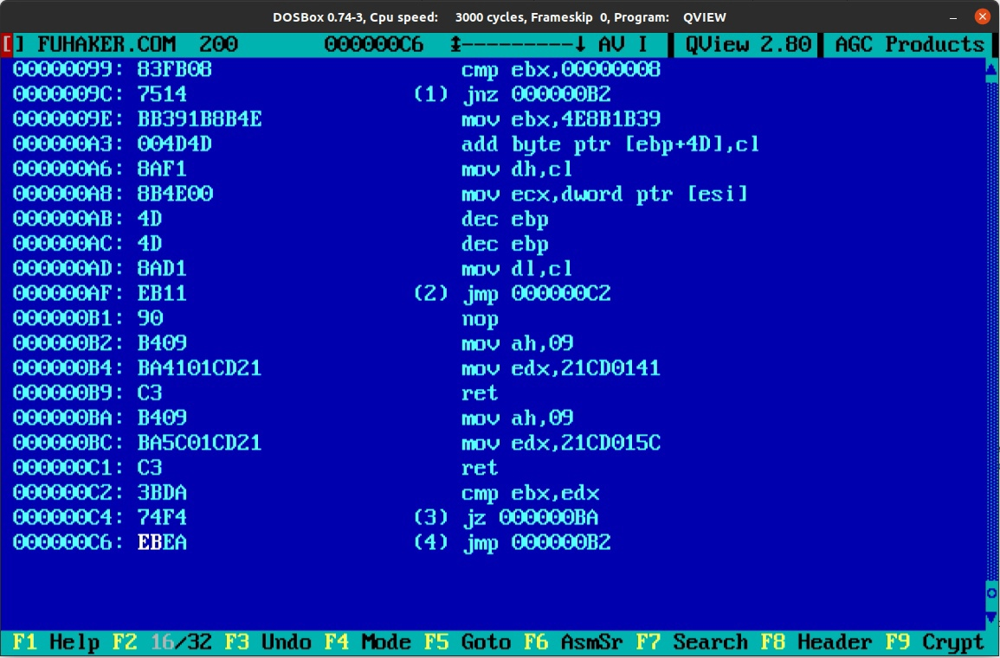
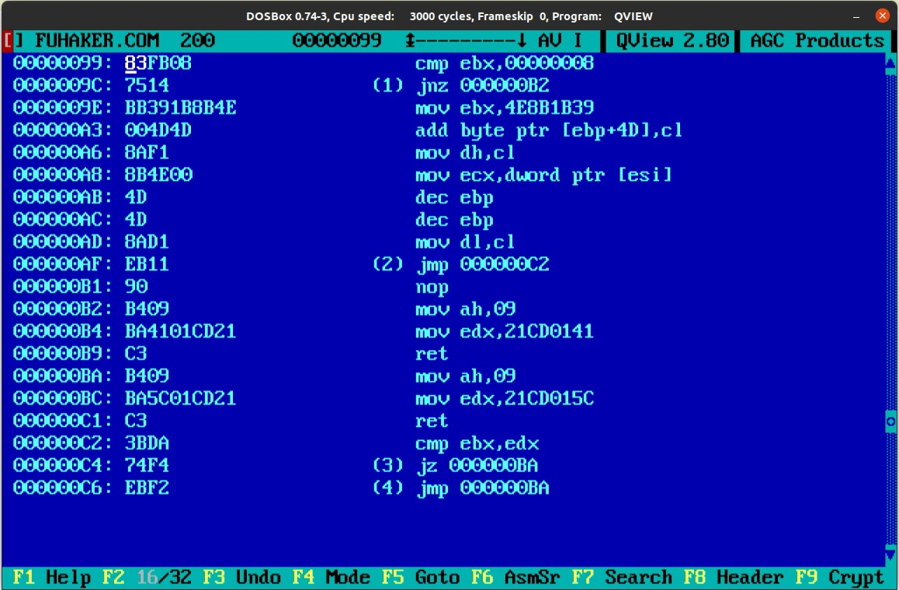
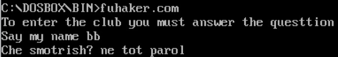
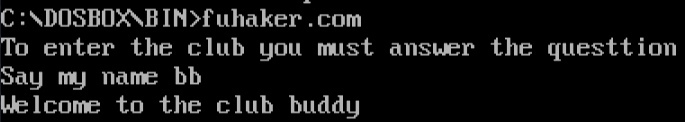
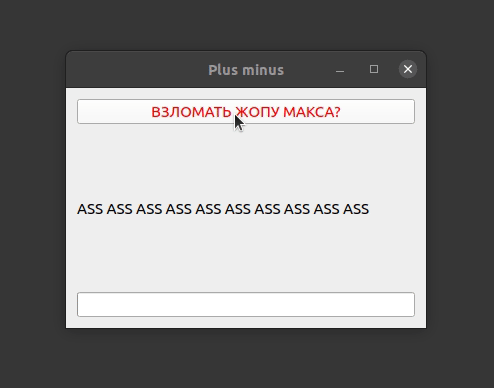

# Crack ( взлом жепы Макса )
> sorry for my English

# Content
1. [Introduction](#intro)
2. [How it works](#how)
3. [Example](#ex)
4. [Example v2 ( using QT )](#ex2)
5. [Conclusion](#conc)

<a name="intro"></a>
## 1. Introduction

The main goal was to find vulnerability and hack simple executable .com file.

<a name="how"></a>
## 2. How it works

I started with reading **fuhaker.com** and understood that there is password length check. Password length = 2.

Also, in the end of file I saw two similar pieces of code starting with lines 000000B2 and 000000BA. I thought it was exits from the program and tried to replace it.



from **jmp 000000B2** to **jmp 000000BA** :



I wrote short code using my my own library **Text**:
```C
char* path = "/home/d0p1er/.dosbox/DOSBox/Bin/FUHAKER.COM";
size_t size_file = GetFileSize(path);
char* buffer = GetTextFromFile(path, size_file);
buffer[size_file - 1] = 242;
WriteText(buffer, path, size_file);
```
And it works.

Before crack ( взлома жепы Макса ) : I can't enter the club by name "bb"... :frowning_face: :disappointed: :cry:


But after crack ( взлома жепы Макса ) : I'm in the club. :smirk: :sunglasses:


<a name="ex"></a>
## 3. Example:

I decided to embellish a little.


But it's not serious for a real hacker like me.

Whereupon I decided to write GUI in QT. It was hard, because I haven't used it before, but now you can watch crack v2 ( взлом жепы Максика PROFESSIONAL VERSION )

<a name="ex2"></a>
## 4. Example v2 ( using QT ):



:dark_sunglasses: :unlock: :radioactive:

<a name="intro"></a>
## 5. Conclusion

It works very good and also it looks awesome. I got a little familiar with hacking and QT. :feelsgood: