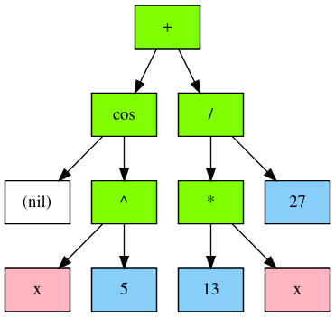
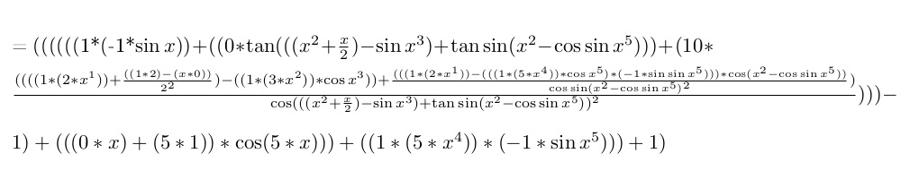
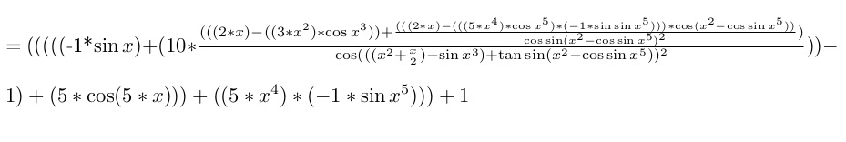

# Differentiator
> sorry for my English

# Content
1. [Introduction](#intro)
2. [How it works](#how)
3. [Optimization](#opt)
4. [Example](#ex)
4. [Conclusion](#conc)

<a name="intro"></a>
## 1. Introduction

I think you often encountered such a problem when you need to calculate the derivative of a huge function. At least i do. :sob:

For such lazy people this program was created.

<a name="how"></a>
## 2. How it works

It's based on my own written **Tree**.

For convenience of input data ( everything for the user :hugs: ) I use recursive descent, which can be easily described using Extended Backus–Naur Form ( EBNF ):

```ebnf
G ::= E$
E ::= T{[+-]T}*
T ::= D{[*/]D}*
P ::= (E) | N | F | V
N ::= ['0'-'9']+
D ::= F{[^]F}*
V ::= 'a'-'z'
F ::= {['a'-'z', 'A'-'Z']P}*
```

Also I add graphviz to debug or just watch the tree. From **COS(x^5) + (13 * x)/27** you get this:



To make code readable I use a little defines in some functions like this:

```C
struct NodeTree* Differentation(struct NodeTree* node, struct Tree* tree, FILE* file) {
	struct NodeTree* tmp = calloc(1, sizeof(tmp[0]));
	switch (node->type_data) {
		case NUMBER: 	DBG printf("NUM\n");	RETNODE(CREATE_NUM_NODE(0));  
		case VARIABLE: 	DBG printf("VAR\n");	RETNODE(CREATE_NUM_NODE(1));
		case OPERATION:
			switch ((int) DATA) {
				case ADD: DBG printf("ADD\n"); RETNODE(ADDITION(dL, dR));
				case SUB: DBG printf("SUB\n"); RETNODE(SUBTRACT(dL, dR));
				case MUL: DBG printf("MUL\n"); RETNODE(ADDITION(MULTIPLY(dL, cR), MULTIPLY(cL, dR)));
				case DIV: DBG printf("DIV\n"); RETNODE(DIVISION(SUBTRACT(MULTIPLY(dL, cR), MULTIPLY(cL, dR)), POWER(cR, CREATE_NUM_NODE(2))));
				case POW: {
					if (R->type_data == NUMBER) {
						RETNODE(MULTIPLY(dL, MULTIPLY(CREATE_NUM_NODE(R->data), POWER(cL, CREATE_NUM_NODE((int) R->data - 1)))));
					}
					else if (L->type_data == NUMBER) {
						RETNODE(MULTIPLY(CopyNode(node), MULTIPLY(dR, LOGN(cR))));
					}
				}
				default:  printf("UNKNOWN OPERATION\n"); RETNODE(node);
			}
		case FUNCTION:
			#define DEF_FUNC(name, num, tex, code)	\
				if ((int) DATA == num) {			\
					DBG printf("%s\n", #name); 		\
					RETNODE(code);					\
				}

			#include "../Data/functions.h"

			#undef DEF_FUNC

		default: printf("TYPE ERROR\n"); return node;
	}
}
```

For such an implementation I use the so-called DSL:

```C
#define DATA node->data
#define L node->left
#define R node->right
#define dL Differentation(L, tree, file)
#define dR Differentation(R, tree, file)
#define cL CopyNode(L)
#define cR CopyNode(R)

#define DO_OPER(oper) Eval(L) oper Eval(R)
#define CREATE_NUM_NODE(val)	CreateNode(NUMBER, val, NULL, NULL)
#define ADDITION(l, r)			CreateNode(OPERATION, ADD, l, r)
#define SUBTRACT(l, r)			CreateNode(OPERATION, SUB, l, r)
#define MULTIPLY(l, r)			CreateNode(OPERATION, MUL, l, r)
#define DIVISION(l, r)			CreateNode(OPERATION, DIV, l, r)
#define POWER(l, r)				CreateNode(OPERATION, POW, l, r)
#define COSINUS(r)				CreateNode(FUNCTION, 1000, NULL, r)
#define SINUS(r)				CreateNode(FUNCTION, 1001, NULL, r)
#define LOGN(r)					CreateNode(FUNCTION, 1010, NULL, r)


#define RETNODE(n) return PrintEqual(node, n, tree, file);
```

And after that I include **functions.h**, where all the added functions are written:

```C
DEF_FUNC(COS, 		1000,	"\\cos ",		MULTIPLY(dR, MULTIPLY(CREATE_NUM_NODE(-1), SINUS(cR))))
DEF_FUNC(SIN, 		1001,	"\\sin ",		MULTIPLY(dR, COSINUS(cR)))
DEF_FUNC(TG, 		1002, 	"\\tan ",		DIVISION(dR, POWER(COSINUS(cR), CREATE_NUM_NODE(2))))
DEF_FUNC(ARCCOS, 	1003,	"\\arccos ",	DIVISION(MULTIPLY(CREATE_NUM_NODE(-1), dR), POWER(SUBTRACT(CREATE_NUM_NODE(1), POWER(cR, CREATE_NUM_NODE(2))), CREATE_NUM_NODE(0.5))))
DEF_FUNC(ARCSIN, 	1004,	"\\arcsin ",	DIVISION(dR, POWER(SUBTRACT(CREATE_NUM_NODE(1), POWER(cR, CREATE_NUM_NODE(2))), CREATE_NUM_NODE(0.5))))
DEF_FUNC(ARCTG, 	1005,	"\\arctan ",	DIVISION(dR, ADDITION(CREATE_NUM_NODE(1), cR)))

DEF_FUNC(LN,		1010,	"\\ln",			DIVISION(dR, cR))
DEF_FUNC(EXP, 		1011,	"e^",			MULTIPLY(dR, POWER(CreateNode(VARIABLE, variables['e'].value, NULL, NULL), cR)))

``` 

It really makes it easier to write and understand code. I swear by my third hand.

<a name="opt"></a>
## 3. Optimization:

When we got the derivative, it at least looks ugly when 0 * x or 0 + x remain. It means that you need to optimize the resulting expression. But you should not be very fanatical because otherwise it will be very very difficult.

For this I wrote function **Simplify**, which check a node for operations with 0 and 1 with others. Also **Simplify** check a node for operations with constants like **27 / 3**.

Some magic and a lot of ifs.

<a name="ex"></a>
## 4. Example:

Before optimization expression:



After optimization:



There are no 0 * tan(...), x^1 = x, 1 * 5 = 5 and much more.

In addition, the whole process of taking the derivative is written in LaTeX then compiles in [pdf file ](https://github.com/d0p1er/phystech/blob/master/C/Differentiator/testlatex.pdf) and you can see even the simplest derivatives were taken ( for example (7)' = 0 ).

<a name="intro"></a>
## 5. Conclusion

It works really good. I hope it'll help you not to take derivatives. :zany_face: :yum: :smirk: :call_me_hand: