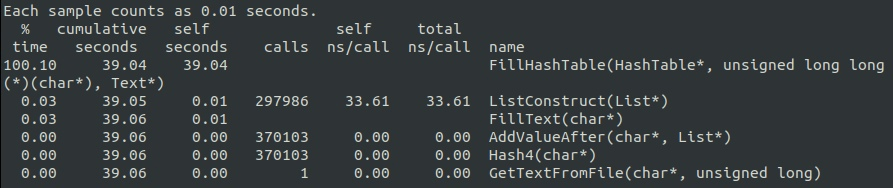
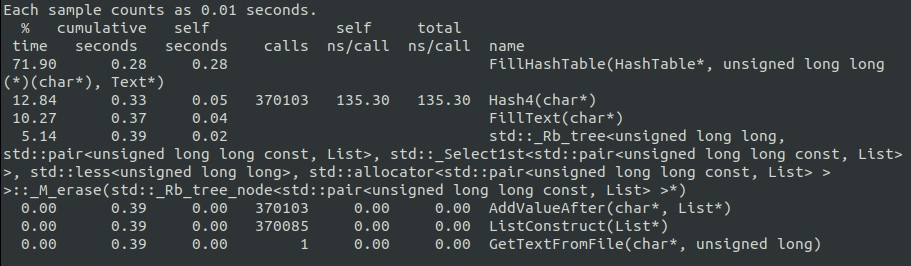
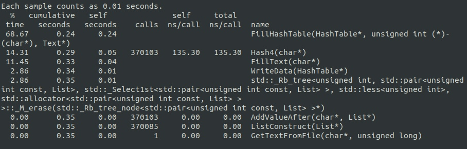
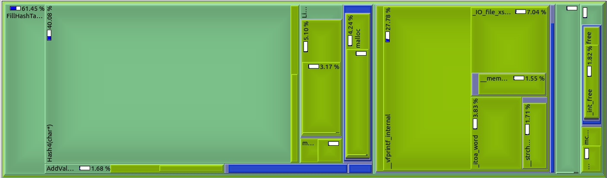
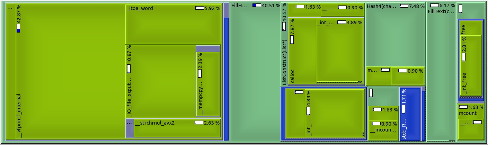
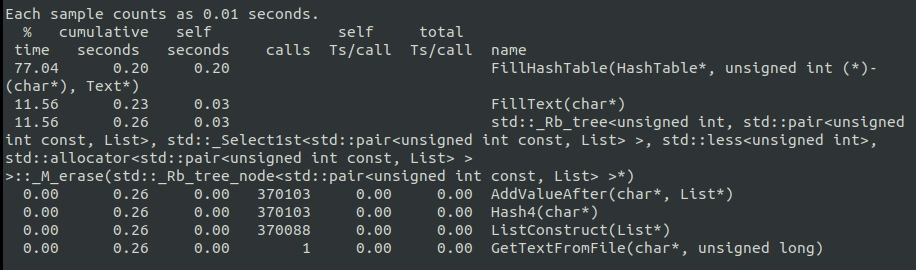

# HashTable Optimization
> sorry for my English

# Content
1. [Introduction](#intro)
2. [Beginning](#begin)
3. [Optimization](#opt)

<a name="intro"></a>
## 1. Introduction

First of all, this project involves comparing 6 hash functions. And in the second part of the project I chose CRC32 and optimized this function, using SSE.

<a name="begin"></a>
## 2. Beginning

The first idea was to use common hash table looked something like this:


```
struct CellHashTable {
	unsigned long long hash_value;
	struct List list;
};

struct HashTable {
	size_t size;
	size_t capacity;
	struct CellHashTable* cells;
};
```

But after I decided to use different structure based on map:
```
struct HashTable {
	size_t size;
	size_t capacity;
	map <unsigned long long, struct List> cells;
};
```

Because I thought it would be easier and more beautiful. And it really made the program run faster))).

Before:

After:


This made the program 100 times faster.


I understood that using unsigned long long wasn't a good idea because it took up a lot of memory and max hash_value ~ 10^9 and I can use unsigned int


It made the program 11% faster. That's good.

<a name="opt"></a>
## 2. Optimization

Now profiling starts.
I use valgrind to profile my project.



I see that Hash4() takes about 40% of the program's running time:

```
unsigned int Hash4(char* data) {
	const unsigned int Polynomial = 0xEDB88320;
	unsigned int crc = 0;
	size_t length = 32;
	while (length--) {
		crc ^= *data++;

		for (unsigned int j = 0; j < 8; j++)
			crc = (crc >> 1) ^ (-int(crc & 1) & Polynomial);
	}

	return crc;
}
```

And I decided to rewrite the function with SSE:

```
unsigned int Hash4(char* str){
	unsigned int hash = 0;
	for (size_t i = 0; i < 32; ++i) {
		hash = _mm_crc32_u32(hash, *str);
		str++;
	}

	return hash;
}
```




It made the program 25% faster. Awesome!!!

In the end, it was possible to speed up the project 140 times.