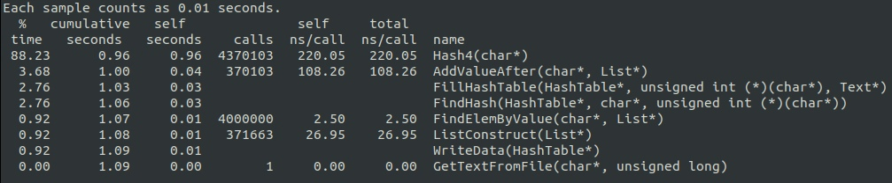
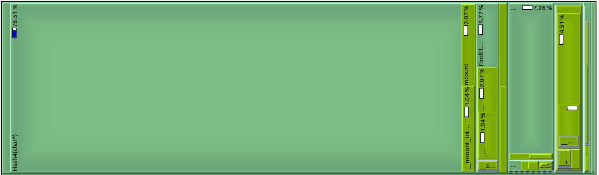
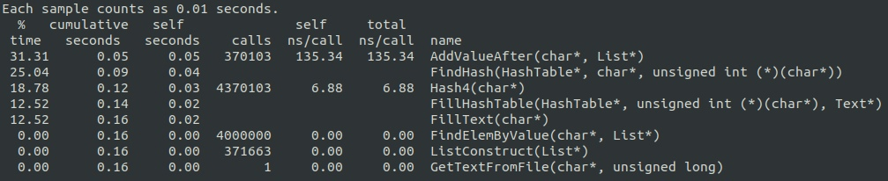
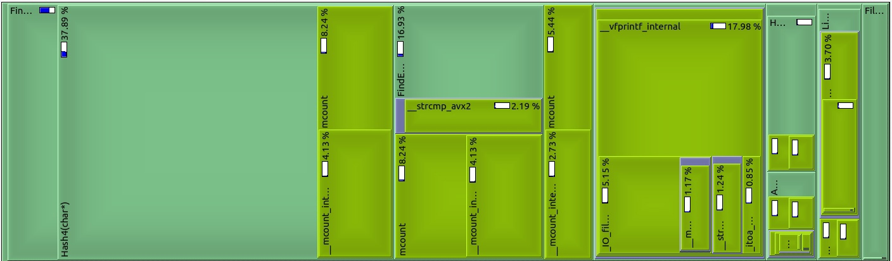
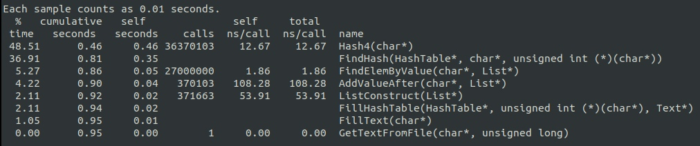
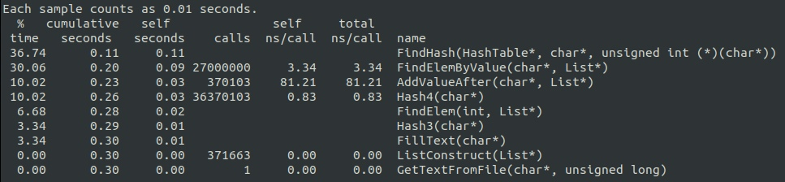
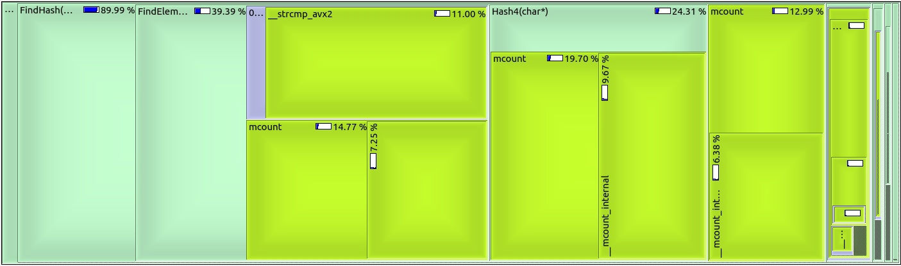
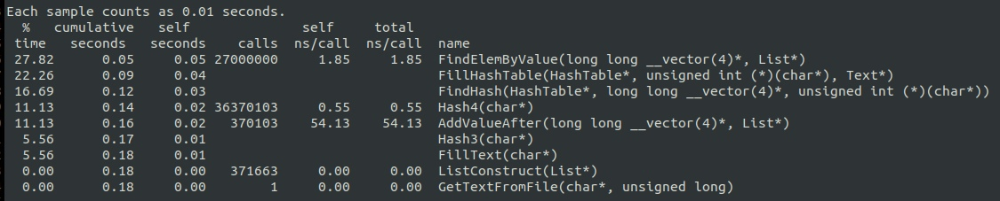
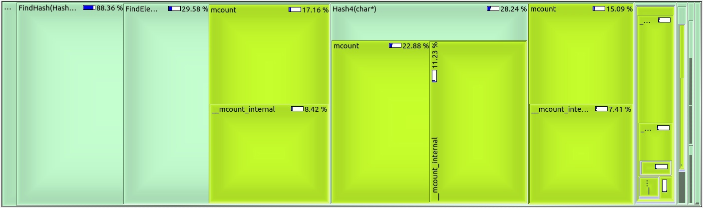

# HashTable Optimization
> sorry for my English

# Content
1. [Introduction](#intro)
2. [Beginning](#begin)
3. [Optimization](#opt)
4. [Conclusion](#conc)

<a name="intro"></a>
## 1. Introduction

First of all, this project involves comparing 6 hash functions. And in the second part of the project I chose CRC32 and optimized this function, using SSE.

<a name="begin"></a>
## 2. Beginning

The first idea was to use common hash table looked something like this:


```
struct CellHashTable {
	unsigned int hash_value;
	struct List list;
};

struct HashTable {
	size_t size;
	size_t capacity;
	struct CellHashTable* cells;
};
```

<a name="opt"></a>
## 3. Optimization

Function Hash4 took a lot of program's running time and I decided to rewrite it with SSE :

Before :

```
unsigned int Hash4(char* data) {
	const unsigned int Polynomial = 0xEDB88320;
	unsigned int crc = 0;
	size_t length = 32;
	while (length--) {
		crc ^= *data++;

		for (unsigned int j = 0; j < 8; j++)
			crc = (crc >> 1) ^ (-int(crc & 1) & Polynomial);
	}

	return crc;
} 
```





After:

```
unsigned int Hash4(char* str) {
	unsigned int hash = 0;
	for (size_t i = 0; i < 8; ++i) {
		hash = _mm_crc32_u32(hash, *str);
		str++;
	}

	return hash;
}
```





It made the program 331% faster


I increase the number of cycle passes.




We also see that Hash4 takes a lot of program's running time

```
unsigned int Hash4(char* str) {
	u_int64_t hash = 0;
	u_int64_t* data = (u_int64_t*) str;
	for (u_int32_t i = 0; i < 4; ++i) {
		hash = _mm_crc32_u64(hash, data[i]);
	}
	return (u_int32_t)hash;
}
```





It made the program 217% faster

I saw that strcmp takes about 11% and decided to rewrite it using __m256i* instead of char* :

Before:
```
int FindElemByValue(TYPE_LIST value, struct List* list) {
	int pos = list->head;
	if (!strcmp(list->nodes[pos].value, value))
		return pos;

	while (list->nodes[pos].next != 0) {
		pos = list->nodes[pos].next;
		if (!strcmp(list->nodes[pos].value, value))
			return pos;
	}

	return -1;
}
```

After:
```
int FindElemByValue(TYPE_LIST value, struct List* list) {
	int pos = list->head;

	if (_mm256_movemask_epi8 (_mm256_cmpeq_epi32 (*(list->nodes[pos].value), *value)) == -1)
		return pos;

	while (list->nodes[pos].next != 0) {
		pos = list->nodes[pos].next;
		if (_mm256_movemask_epi8 (_mm256_cmpeq_epi32 (*(list->nodes[pos].value), *value)) == -1)
			return pos;
	}
	return -1;
}
```

In gave an increase about 67%






<a name="intro"></a>
## 4. Conclusion

As a result, optimization of the hashtable gave an increase of 22.82 times

That sounds good